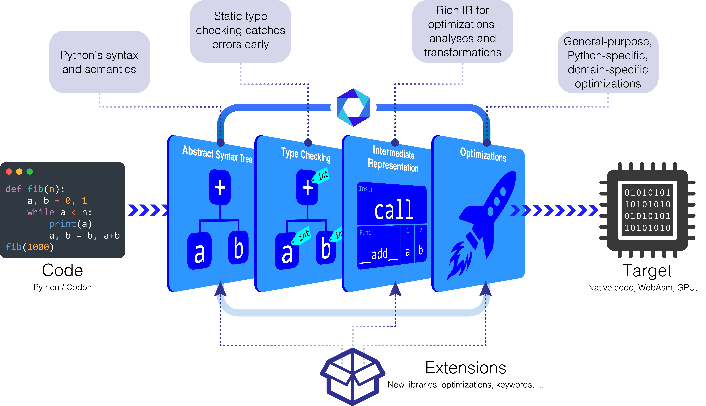

Codon is a high-performance Python compiler that compiles Python code to
native machine code without any runtime overhead. Typical speedups over
Python are on the order of 100x or more, on a single thread. Codon
supports native multithreading which can lead to speedups many times higher still.

The Codon framework is fully modular and extensible, allowing for the
seamless integration of new modules, compiler optimizations, domain-specific
languages and so on. We actively develop Codon extensions for a number of
domains such as bioinformatics and quantitative finance.

# Codon at a glance

A simple Python program `fib.py`...

``` python
from time import time

def fib(n):
    return n if n < 2 else fib(n - 1) + fib(n - 2)

t0 = time()
ans = fib(40)
t1 = time()
print(f'Computed fib(40) = {ans} in {t1 - t0} seconds.')
```

... run through Python and Codon:

```
$ python3 fib.py
Computed fib(40) = 102334155 in 17.979357957839966 seconds.
$ codon run -release fib.py
Computed fib(40) = 102334155 in 0.275645 seconds.
```
