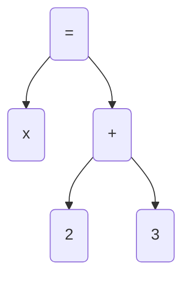
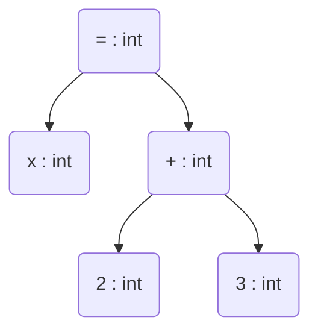
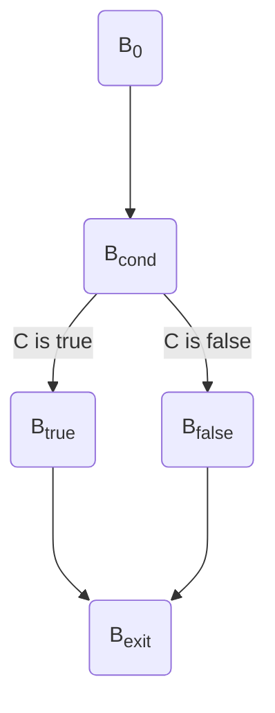
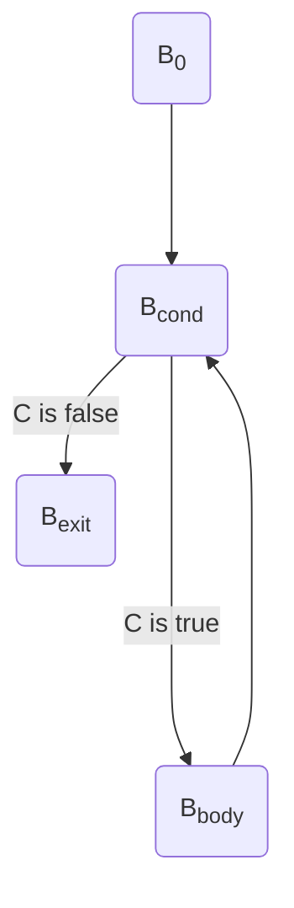
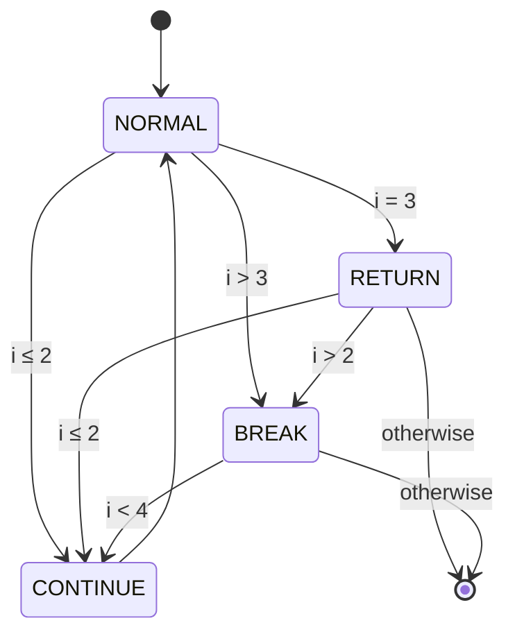

This page describes the internal compilation flow from source code to native code.
It is intended for Codon developers and contributors seeking to understand or extend
the compiler.

<figure markdown="span">
  { width="100%" }
  <figcaption>Codon compilation pipeline</figcaption>
</figure>

## Overview

Codon compiles Python code to native machine code using a custom frontend (parser and type
checker), an intermediate representation (IR), and LLVM as the backend. The compilation
process is ahead-of-time (AOT) by default, though a just-in-time (JIT) mode is available
as well.

The major compilation stages are:

1. [Parsing](#parsing)
2. [Type checking](#type-checking)
3. [Codon IR generation](#codon-ir-generation)
4. [Codon IR optimization](#codon-ir-optimization)
5. [LLVM lowering](#llvm-lowering)
6. [Code generation](#code-generation)

## Parsing

The parser converts source code into an [abstract syntax tree](https://en.wikipedia.org/wiki/Abstract_syntax_tree)
(AST) using Python's grammar.
Codon uses a custom [PEG](https://en.wikipedia.org/wiki/Parsing_expression_grammar) parser.

For example, this code:

``` python
x = 2 + 3
```

would create the following AST after parsing:



Relevant code and grammars can be found in
[`codon/parser/peg/`](https://github.com/exaloop/codon/tree/develop/codon/parser/peg).


## Type checking

Unlike CPython, Codon performs type checking to determine data types ahead of time.
Type checking is applied on the AST, and attaches a type to every applicable AST node.
For example, the AST above would be typed as follows:



In practice, numerous translation steps are applied to the AST as well. For example, operators like
`+`, `-`, etc. are replaced by magic method calls like `int.__add__`, `float.__sub__`, etc. Similarly,
functions without explicit type annotations are specialized when called for the given argument types,
a technique known as [*monomorphization*](https://en.wikipedia.org/wiki/Monomorphization).

Internally, Coodn's type checker uses a modified
[Hindley-Milner](https://en.wikipedia.org/wiki/Hindley–Milner_type_system) type system, adapted to handle
various special cases relevant to Python code and semantics.

Relevant code can be found in
[`codon/parser/visitors/typecheck/`](https://github.com/exaloop/codon/tree/develop/codon/parser/visitors/typecheck).
See also the [*CC 2023* Codon paper](https://dl.acm.org/doi/abs/10.1145/3578360.3580275) for a
detailed overview of Coodn's type checker.


## Codon IR generation

After type checking, the typed AST is lowered to [Codon IR](/developers/ir). Codon IR utilizes
a vastly reduced set of nodes as compared to the AST, making it more practical for optimizations
and analyses.

Relevant code can be found in
[`codon/parser/visitors/translate/`](https://github.com/exaloop/codon/tree/develop/codon/parser/visitors/translate).


## Codon IR optimization

Codon IR performs a suite of analyses and optimizations, ranging from general-purpose compiler
optimizations like constant folding and dead code elimination to more specialized optimizations
like operator fusion for NumPy. Learn more in the [Codon IR docs](/developers/ir).

Relevant code can be found in
[`codon/cir/`](https://github.com/exaloop/codon/tree/develop/codon/cir).


## LLVM lowering

Next, Codon IR is lowered to [LLVM IR](https://llvm.org/docs/LangRef.html). Below,
we describe this process in detail.

### Python types to LLVM types

Python types need to be mapped to LLVM types. Some of the conversions are quite straightforward:

- `int` becomes an LLVM `i64` (note that this deviates from Python's arbitrary-
  width integers)
- `float` becomes an LLVM `double`
- `bool` becomes an LLVM `i8` (we could use `i1` in theory, but `i8` is
  compatible with C/C++)

Tuple types are converted to `struct`s containing the tuple's element types.
For example, the type of `(42, 3.14, True)` becomes the LLVM structure
type `{i64, double, i8}`. Since tuples are immutable, these structs are passed by
value, and in many cases tuples are completely optimized out by LLVM's optimization
passes.

User-defined classes are similar, except instead of passing by value, they are dynamically
allocated and passed by pointer, which allows mutations to be handled correctly.
For example, consider:

``` python
class C:
    a: int
    b: float
    c: bool
```

When creating an instance `C()`, under the hood a dynamic memory allocation occurs to store
the contents of the same `{i64, double, i8}`, and return a pointer to that memory as
the result of instantiation (after calling `C.__init__()`).

There are several other LLVM types that Codon exposes, like `Ptr[T]` to
represent a pointer to an object of type `T`. Other Python types, however,
are constructed from these building blocks. For example, the built-in collection
types like `list`, `dict` and `set` are all implemented within Codon as classes; some
other built-in types are implemented as named tuples, and so on.

### Operators

Codon IR has no concept of operators like `+`, `-`, etc. Instead, it represents these
operations as magic method calls. Magic methods of primitive types like `int` are
implemented in Codon using [inline LLVM](/language/llvm). For example:

``` python
class int:
    ...

    @llvm
    def __add__(self, other: int) -> int:
        %tmp = add i64 %self, %other
        ret i64 %tmp

    @llvm
    def __add__(self, other: float) -> float:
        %tmp1 = sitofp i64 %self to double
        %tmp2 = fadd double %tmp1, %other
        ret double %tmp2
```

Note that Codon supports method overloading: the compiler will choose the correct
`__add__` based on the right-hand side's type during the parsing and type checking
stages.

### Control flow

Control flow constructs require the creation of multiple LLVM
[*basic blocks*](https://en.wikipedia.org/wiki/Basic_block).
For example, consider the following pseudocode:

``` python
if condition:
    true_branch
else:
    false_branch
```

Compilation would roughly proceed as follows, where $B$ denotes the *current* basic block
as maintained by the LLVM lowering pass, and is where all new instructions are inserted:

1. Create four new basic blocks: $B_\mathrm{cond}$, $B_\mathrm{true}$,
   $B_\mathrm{false}$ and $B_\mathrm{exit}$.

2. Generate a branch to $B_\mathrm{cond}$.

2. Set $B \gets B_\mathrm{cond}$ and generate code $C$ for `condition`, then generate
   a conditional branch to $B_\mathrm{true}$ and $B_\mathrm{false}$ based on $C$.

3. Set $B \gets B_\mathrm{true}$ and generate code for `true_branch`, then add a
   branch to $B_\mathrm{exit}$.

4. Set $B \gets B_\mathrm{false}$ and generate code for `false_branch`, then add a
   branch to $B_\mathrm{exit}$.

5. Set $B \gets B_\mathrm{exit}$.

As a diagram...



Here is another example involving a loop:

``` python
while condition:
    body
```

Compilation would proceed as follows:

1. Create three new basic blocks: $B_\mathrm{cond}$, $B_\mathrm{body}$ and
   $B_\mathrm{exit}$

2. Generate a branch to $B_\mathrm{cond}$.

3. Set $B \gets B_\mathrm{cond}$ and generate code $C$ for `condition`, then
   generate a conditional branch to $B_\mathrm{body}$ and $B_\mathrm{exit}$
   based on $C$.

4. Set $B \gets B_\mathrm{body}$ and generate code for `body`, then add a
   branch to $B_\mathrm{cond}$.

5. Set $B \gets B_\mathrm{exit}$.

Again as a diagram...



`break` and `continue` are supported as follows: `break` simply becomes a branch to
$B_\mathrm{exit}$ and `continue` becomes a branch to $B_\mathrm{cond}$. One notable
exception to this pertains to `finally` blocks, which is discussed below.

Other control flow constructs (like `elif`) work in an analogous way, and
in fact can be constructed using just `if`-`else` and `while`.

### `try`-`except`-`finally`

`try`-`except`-`finally` is much more complex than other control flow constructs in terms
or how it maps to LLVM IR. Exception handling itself is implemented in Codon using the
[Itanium C++ ABI](https://itanium-cxx-abi.github.io/cxx-abi/abi-eh.html)
for zero-cost exceptions, along with LLVM's exception handling instructions:
(`landingpad`, `resume`, `invoke`) and specialized
[*personality function*](https://itanium-cxx-abi.github.io/cxx-abi/abi-eh.html#base-personality).
There is additional bookkeeping required for knowing when we're compiling inside
a `try` block, which requires functions to be called with the LLVM `invoke` instruction
(rather than the usual `call`) and to specify a basic block to branch to if an exception
occurs (i.e. the basic block corresponding to `except`).

`try`-`except`-`finally` becomes complex in cases where `finally` changes control flow
in non-trivial ways, such as:

``` python
def foo():
    try:
        return 1
    finally:
        return 2
```

What does `foo()` return? If you're not familiar with `finally` semantics, you might be
inclined to say `1`, but the correct answer is `2`: `finally` blocks are *always* executed.

This has important implications for compilation: namely, *branches always need to be
aware of enclosing `try`-`finally` blocks*. Here is another example:

``` python
def bar():
    for i in range(10):
        print(i)
        try:
            if i == 5:
                break
        finally:
            continue
```

When `i == 5`, we'll reach the `break` statement, *but
the `break` needs to actually branch to the `finally` block*, otherwise the `finally`
block would we skipped over. Now, the `finally` itself has a `continue`, which overrides
the previous `break` and resumes the loop. So, in the end, all the integers `0`...`9`
are printed.

To generate correct code for `try`-`except`-`finally`, Codon does the following:

- Firstly, the LLVM lowering pass maintains a stack of enclosing `try`-`except`-`finally` blocks,
  since if we reach a `return`, `break` or `continue`, we need to know whether
  we really need to branch to some `finally` block.

- Next, it constructs a state machine for each series of nested `try`-`except`-`finally`
  blocks, since once we *do* reach the `finally`, we need to know how we got there in order to
  determine what action needs to be taken next. For instance, if we got there via a `return`,
  we need to actually execute that return statement at the end of the block; or perhaps we got
  there by catching an exception that needs to be delegated to a parent `try`-`except`-`finally`.

The aforementioned state machine has the following states:

- `NORMAL`: The `finally` was reached through normal execution of the code. Nothing special
  needs to be done; just branch to the next block normally.

- `THROWN`: An exception was thrown and we are executing the `finally` before propagating
  the exception out of the function. The exception object itself will be stored in a pre-defined
  place that we can access from the `finally` block.

- `CAUGHT`: An exception was caught and we are reaching the `finally` through some `except` block.
  Again nothing special needs to be done here; just branch to the next block normally.

- `RETHROW`: The `finally` is being executed while unwinding and the exception must be re-thrown.

- `RETURN`: The `finally` was reached after encountering an enclosed `return` statement. After
  executing the `finally`, we need to execute the `return`. The return value itself will be
  stored in a pre-defined place that we can access from the `finally` block.

- `BREAK`: The `finally` was reached after encountering a `break`. We need to actually execute
  the `break` after executing the `finally` block.

- `CONTINUE`: The `finally` was reached after encountering a `continue`. We need to actually
  execute the `continue` after executing the `finally` block.

Importantly, these actions are *recursive*, so when we say *"execute the `return` after
executing the `finally` block"*, that may entail branching to *another* enclosing `finally` block
and repeating the same action.

Here is a real example of what this state machine looks like. Consider:

``` python
def baz():
    for i in range(5):
        try:
            try:
                if i == 3:
                    return i
            finally:
                if i > 2:
                    break
        finally:
            if i < 4:
                continue
    return i
```

Here are the various transitions between the states for different conditions throughout the
loop:



The internal state machine will transition between the states based on these conditions until the
loop terminates, signified by reaching the end state.

### Variables

LLVM IR uses [*static single assignment form*](https://en.wikipedia.org/wiki/Static_single-assignment_form),
or SSA, which effectively means LLVM IR variables must be assigned *exactly* once. As a result, we
can't map Python variables directly to LLVM IR variables. Instead, we map each Python variable to
a stack-allocated piece of memory:

``` python
x = 42
```

becomes:

``` llvm
%x = alloca i64, align 8
store i64 42, i64* %x, align 8
```

`alloca` is an LLVM IR instruction that allocates space on the current stack frame; `alloca i64` allocates
space for a 64-bit integer. Treating variables this way is standard practice when compiling to LLVM IR,
and C/C++ compilers will do the same (e.g. `long x = 42` produces this exact code with Clang).

Many variables are implicitly introduced by the parser and/or type checker. For example:

``` python
a, b = b, a
```

... a common Python idiom for swapping the values of two variables, will implicitly be transformed into

``` python
tmp = (b, a)
a = tmp[0]
b = tmp[1]
```

thus introducing the new variable `tmp`.

### Functions

Python functions map directly to LLVM functions:

``` python
def foo(a: int, b: int):
    return a + b
```

becomes:

``` llvm
define i64 @foo(i64 %0, i64 %1) {
  %a = alloca i64, align 8
  %b = alloca i64, align 8
  store i64 %0, i64* %a, align 8
  store i64 %1, i64* %b, align 8
  %a0 = load i64, i64* %a, align 8
  %b0 = load i64, i64* %b, align 8
  %ans = add nsw i64 %a0, %b0
  ret i64 %ans
}
```

Notice that space is allocated for the arguments via `alloca`, since they should be treated like normal
variables inside the function.

### Generators

Generators are implemented using [LLVM coroutines](https://llvm.org/docs/Coroutines.html).
Coroutines are like functions that allow suspension and resumption (much like what
happens with Python's `yield`). Coroutines maintain their state (i.e. local variables, position in the
function, yielded value) in a *coroutine frame*. Coroutines in LLVM are indeed also like
normal functions, but delineate their resume/suspend points with special intrinsics and "return" a handle
to their coroutine frames. Here are some of the important LLVM intrinsics that Codon uses when generating
code for coroutines:

- `@llvm.coro.id`: Returns a token that can identify the coroutine, which can be passed to many of the
  other intrinsics.
- `@llvm.coro.size.i64`: Returns the size of the coroutine frame for dynamic allocation.
- `@llvm.coro.begin`: Returns a "handle" to the coroutine frame.
- `@llvm.coro.suspend`: Marks a suspension point.
- `@llvm.coro.end`: Marks the end of the coroutine and destroys the coroutine frame.
- `@llvm.coro.resume`: Resumes a coroutine given a coroutine handle.
- `@llvm.coro.done`: Checks if a coroutine is at its final suspend point.
- `@llvm.coro.promise`: Returns a pointer to the *coroutine promise*: a region of memory that stores
  values "yielded" from the coroutine.
- `@llvm.coro.destroy`: Destroys a finished coroutine.

With these primitives, generators are implemented roughly as follows:

- Functions with `yield` are converted to LLVM coroutines.
- Code is generated for `yield` statements by storing the yielded value in the coroutine promise,
  then calling `@llvm.coro.suspend`.
- Python's `next()` built-in is implemented by calling `@llvm.coro.done` to see if the given generator
  is finished, then calling `@llvm.coro.resume` to resume it and finally `@llvm.coro.promise` to obtain
  the generated value.
- `for x in generator` is implemented by repeatedly calling `@llvm.coro.resume`/`@llvm.coro.promise`
  until `@llvm.coro.done` indicates that we should stop.

Here is an example:

``` python
for i in range(3):
    print(i)
```

Here is the (simplified) LLVM IR generated for this snippet:

``` llvm
entry:
  %g = call ptr @range(i64 3)
  br label %for

for:
  call void @llvm.coro.resume(ptr %g)
  %done = call i1 @llvm.coro.done(ptr %g)
  br i1 %done, label %exit, label %body

body:
  %p = call ptr @llvm.coro.promise(ptr %g, i32 8, i1 false)
  %i = load i64, ptr %p
  call void @print(i64 %i)
  br label %for

exit:
  call void @llvm.coro.destroy(ptr %g)
```

In summary:

- The call to `@range` returns a *handle* (with type `ptr`) to the range generator.
- The generator is resumed with `@llvm.coro.resume` (note that all coroutines will be initially suspended to
  match Python's generator semantics).
- If `@llvm.coro.done` indicates that the generator is done, the loop is exited and `@llvm.coro.destroy` is
  called to destroy the generator.
- Otherwise, in the body of the loop, the next value for `i` is obtained by calling `@llvm.coro.promise`
  (the other arguments are simply the alignment of the promise (`i32 8`) and whether we want to obtain a
  promise given a handle or vice versa (`i1 false`)).

Coroutines are heavily optimized by LLVM. The code above, after optimizations are applied, becomes simply:

``` llvm
  call void @print(i64 0)
  call void @print(i64 1)
  call void @print(i64 2)
```

!!! info

   Codon's LLVM fork implements coroutine elision analysis through escape analysis of the coroutine
   handle, as opposed to the standard analysis that relies on examining `@llvm.coro.destroy` calls.
   This was found to be much better at determining which coroutines can be optimized away.

### Program structure

Python doesn't have an explicit `main()` function as an entry point like C does.
However, we need to generate a `main()` function in LLVM IR to be able to execute the generated code..

Codon handles this by putting everything at the top level into its own implicit function:

``` python
a = 42
print(a * 2)
```

becomes:

``` python
a = 0
def main():
    global a
    a = 42
    print(a * 2)
```

If compiling to a shared object, a [global constructor](https://en.wikipedia.org/wiki/Crt0)
is added to call the implicit `main()`, which ensures initialization is still performed.

Relevant code can be found in
[`codon/cir/llvm`](https://github.com/exaloop/codon/tree/develop/codon/cir/llvm).


## Code generation

Codon invokes LLVM’s code generation infrastructure to emit native code. This also includes
invoking LLVM's optimization pipeline when compiling in release mode (corresponding to Clang's
`-O3`). Codon also has several of its own LLVM optimization passes:

- Allocation removal pass: Lowers dynamic allocation of known, small size to stack allocations.
  This is useful when e.g. instantiating classes that don't escape the enclosing function.
- Allocation hoist pass: Hoists dynamic allocations outside of loops when possible. This allows
  the same memory to be reused across loop iterations which improves cache performance.
- Allocation free pass: Automatically frees dynamic allocations when they are no longer being
  used. Improves cache performance. This pass is off by default but can be enabled with the
  hidden `-auto-free` compiler flag.
- Coroutine branch simplification pass: Some of LLVM's standard coroutine passes can result
  in complex branches that are difficult to reason about. This pass simplifies those branches.
- Architecture-specific passes: Enables vectorization and other features specific to the host
  architecture. Similar to `-march=native` in Clang. Can be disabled with the `-disable-native`
  compiler flag.

### GPU code generation

If the program contains [GPU kernels](/parallel/gpu), those kernels are separated into a new
LLVM module to be handled specially. In particular:

- Certain functions are replaced with GPU-compatible alternatives. For instance, the `sqrt()`
  function might be replaced with `__nv_sqrt` from CUDA's libdevice library.
- Exceptions are disabled and replaced with unreachable directives, which enables additional
  optimizations.
- The module is compiled to [PTX](https://en.wikipedia.org/wiki/Parallel_Thread_Execution) code
  and written to disk. The PTX code is then loaded at runtime to invoke the kernel.


## JIT compilation

Codon also includes a JIT based on LLVM's [ORC JIT](https://llvm.org/docs/ORCv2.html) and implemented
with LLVM's [`LLJIT`](https://llvm.org/doxygen/classllvm_1_1orc_1_1LLJIT.html). This JIT
is used to support the [`@codon.jit` Python decorator](/integrations/python/codon-from-python) as
well as [Codon's Jupyter kernel](/integrations/jupyter).

Note that `codon run` also uses `LLJIT` to execute the generated LLVM code.

Relevant code can be found in
[`codon/compiler/`](https://github.com/exaloop/codon/tree/develop/codon/compiler).


## Debugging

The `-log l` flag will dump the outputs of the various compilation stages to files that can be
examined. This includes:

- AST with type information
- Both unoptimized and optimized Codon IR
- LLVM IR

See the [relevant docs](/start/usage#logging) for other debugging options.
