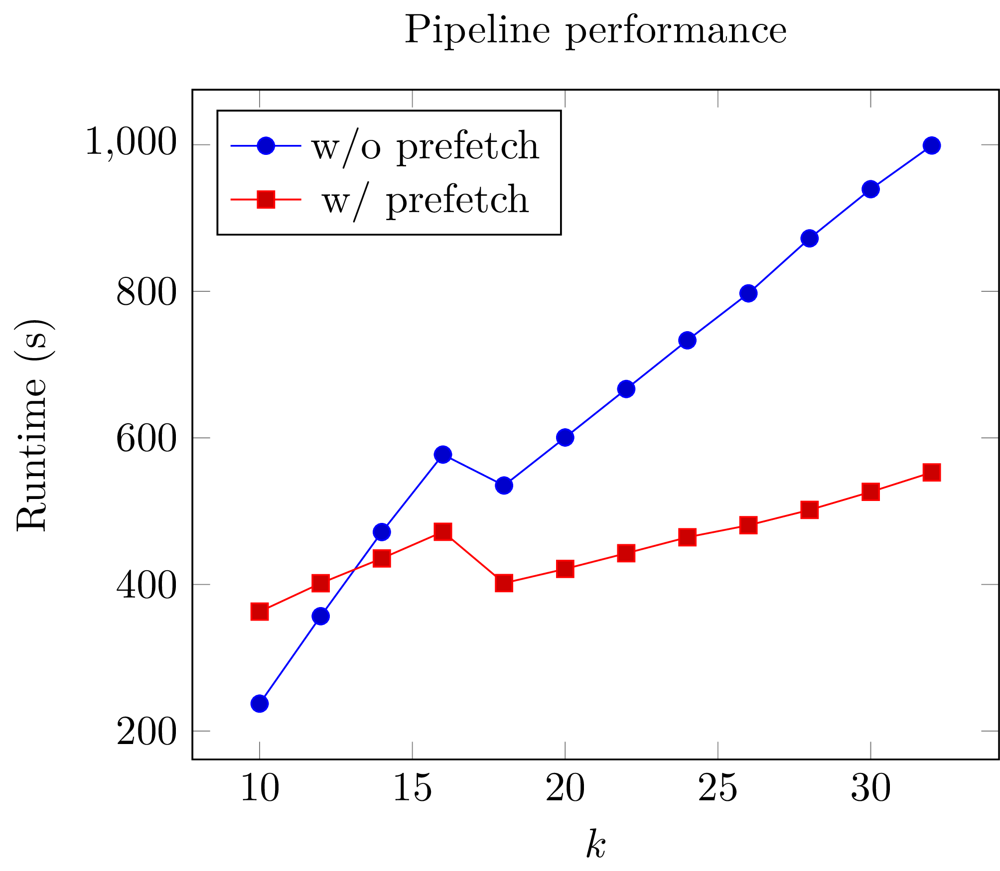

Tutorial
========

Bio-specific features
---------------------

Seq's ``bio`` module contains all the following functions, types, and methods. The code snippets below should be preceded with ``from bio import *``, although we omit that line for simplicity below.

Genomic types
^^^^^^^^^^^^^

Seq's namesake type is indeed the sequence type: ``seq``. A ``seq`` object represents a DNA sequence of any length and---on top of general-purpose string functionality---provides methods for performing common sequence operations such as splitting into subsequences, reverse complementation and :math:`k`-mer extraction. Alongside the ``seq`` type are :math:`k`-mer types, where e.g. ``Kmer[1]`` represents a 1-mer, ``Kmer[2]`` a 2-mer and so on, up to ``Kmer[1024]``.

Sequences can be seamlessly converted between these various types:

.. code-block:: seq

    dna = s'ACGTACGTACGT'  # sequence literal

    # (a) split into subsequences of length 3
    #     with a step of 2
    for sub in dna.split(k=3, step=2):
        print(sub)
        print(~sub)  # reverse complement

    # (b) split into 5-mers with step 1 (default)
    for kmer in dna.kmers(k=5):
        print(kmer)
        print(~kmer)  # reverse complement

    # (c) convert entire sequence to 12-mer
    kmer = Kmer[12](dna)

Seq also supports a ``pseq`` type for protein sequences:

.. code-block:: seq

    protein = p'HEAGAWGHE'           # pseq literal
    print(list(protein.split(3, 3)))  # [HEA, GAW, GHE]
    print(s'ACCATGACA' |> translate)  # TMT

.. Note:: What's the difference between sequences and :math:`k`-mers in Seq? Sequences have arbitrary length and allow for ambiguous bases like ``N``. :math:`k`-mers, on the other hand, have a length that is fixed and must be known at compile time, only allowing for ``ACGT`` bases. :math:`k`-mers can therefore be represented internally as 2-bit encoded integers, making them compact and very efficient to manipulate.

In practice, sequences would be read from e.g. a FASTQ file:

.. code-block:: seq

    for record in FASTQ('input.fq'):
        print('processing', record.name)
        process(record.seq)

If you only care about the sequences, you can also do this:

.. code-block:: seq

    for read in FASTQ('input.fq') |> seqs:
        process(read)

Common formats like FASTQ, FASTA, SAM, BAM and CRAM are supported. The ``FASTQ`` and ``FASTA`` parsers support several additional options:

- ``validate`` (``True`` by default): Perform data validation as sequences are read
- ``gzip`` (``True`` by default): Perform I/O using zlib, supporting gzip'd files (note that plain text files will still work with this enabled)
- ``fai`` (``True`` by default; FASTA only): Look for a ``.fai`` file to determine sequence lengths before reading

For example:

.. code-block:: seq

    for read in FASTQ('input.fq', validate=False, gzip=False) |> seqs:
        process(read)

To read protein sequences, you can use ``pFASTA``, which has the same interface as ``FASTA`` (but does not support ``fai``):

.. code-block:: seq

    for p in pFASTA('input.fa') |> seqs:
        process(p)

.. _match:

Sequence matching
^^^^^^^^^^^^^^^^^

Seq provides the conventional ``match`` construct, which works on integers, lists, strings and tuples. Here's a simple example:

.. code-block:: seq

    def describe(n: int):
        match n:
            case m if m < 0:
                print('negative')
            case 0:
                print('zero')
            case m if 0 < m < 10:
                print('small')
            case _:
                print('large')

A novel aspect of Seq's ``match`` statement is that it also works on sequences, and allows for concise recursive representations of several sequence operations such as subsequence search, reverse complementation tests and base counting, as shown in this example:

.. code-block:: seq

    # (a)
    def has_spaced_acgt(s: seq):
        match s:
            case 'A_C_G_T*':
                return True
            case t if len(t) >= 8:
                return has_spaced_acgt(s[1:])
            case _:
                return False

    # (b)
    def is_own_revcomp(s: seq):
        match s:
            case 'A*T' or 'T*A' or 'C*G' or 'G*C':
                return is_own_revcomp(s[1:-1])
            case s'':
                return True
            case _:
                return False

    # (c)
    @tuple
    class BaseCount:
        A: int
        C: int
        G: int
        T: int

        def __add__(self, other: BaseCount):
            a1, c1, g1, t1 = self
            a2, c2, g2, t2 = other
            return (a1 + a2, c1 + c2, g1 + g2, t1 + t2)

    def count_bases(s):
        match s:
            case 'A*': return count_bases(s[1:]) + (1,0,0,0)
            case 'C*': return count_bases(s[1:]) + (0,1,0,0)
            case 'G*': return count_bases(s[1:]) + (0,0,1,0)
            case 'T*': return count_bases(s[1:]) + (0,0,0,1)
            case _: return BaseCount(0,0,0,0)

- Example (a) checks if a given sequence contains the subsequence ``A_C_G_T``, where ``_`` is a wildcard base.
- Example (b) checks if the given sequence is its own reverse complement.
- Example (c) counts how many times each base appears in the given sequence.

Sequence patterns consist of literal ``ACGT`` characters, single-base wildcards (``_``) or "zero or more" wildcards (``...``) that match zero or more of any base.

.. _pipeline:

Pipelines
^^^^^^^^^

Pipelining is a natural model for thinking about processing genomic data, as sequences are typically processed in stages (e.g. read from input file, split into :math:`k`-mers, query :math:`k`-mers in index, perform full dynamic programming alignment, output results to file), and are almost always independent of one another as far as this processing is concerned. Because of this, Seq supports a pipe operator: ``|>``, similar to F#'s pipe and R's ``magrittr`` (``%>%``).

Pipeline stages in Seq can be regular functions or generators. In the case of standard functions, the function is simply applied to the input data and the result is carried to the remainder of the pipeline, akin to F#'s functional piping. If, on the other hand, a stage is a generator, the values yielded by the generator are passed lazily to the remainder of the pipeline, which in many ways mirrors how piping is implemented in Bash. Note that Seq ensures that generator pipelines do not collect any data unless explicitly requested, thus allowing the processing of terabytes of data in a streaming fashion with no memory and minimal CPU overhead.

Here's an example of pipeline usage, which shows the same two loops from above, but as pipelines:

.. code-block:: seq

    dna = s'ACGTACGTACGT'  # sequence literal

    # (a) split into subsequences of length 3
    #     with a stride of 2
    dna |> split(..., k=3, step=2) |> print

    # (b) split into 5-mers with stride 1
    def f(kmer):
        print(kmer)
        print(~kmer)

    dna |> kmers(k=5, step=1) |> f

First, note that ``split`` is a Seq standard library function that takes three arguments: the sequence to split, the subsequence length and the stride; ``split(..., k=3, step=2)`` is a partial call of ``split`` that produces a new single-argument function ``f(x)`` which produces ``split(x, k=3, step=2)``. The undefined argument(s) in a partial call can be implicit, as in the second example: ``kmers`` (also a standard library function) is parameterized by the target :math:`k`-mer type and takes as arguments the sequence to :math:`k`-merize, the :math:`k`-mer length, and the stride; since just two of the three arguments are provided, the first is implicitly replaced by ``...`` to produce a partial call (i.e. the expression is equivalent to ``kmers(..., k=5, step=1)``). Both ``split`` and ``kmers`` are themselves generators that yield subsequences and :math:`k`-mers respectively, which are passed sequentially to the last stage of the enclosing pipeline in the two examples.

.. caution::
    The Seq compiler may perform optimizations that change the order of elements passed through a pipeline. Therefore, it is best to not rely on order when using pipelines. If order needs to be maintained, consider using a regular loop or passing an index alongside each element sent through the pipeline.

Sequence alignment
^^^^^^^^^^^^^^^^^^

Aligning sequences is very straightforward in Seq, and supports numerous options/variants:

.. code-block:: seq

    # default parameters
    s1 = s'CGCGAGTCTT'
    s2 = s'CGCAGAGTT'
    aln = s1 @ s2
    print(aln.cigar, aln.score)

    # custom parameters
    # match = 2; mismatch = 4; gap1(k) = 2k + 4; gap2(k) = k + 13
    aln = s1.align(s2, a=2, b=4, gapo=4, gape=2, gapo2=13, gape2=1)
    print(aln.cigar, aln.score)

Here is the list of options supported by the ``align()`` method; all are optional (default is global alignment):

- ``a``: match score
- ``b``: mismatch score
- ``ambig``: ambiguous (i.e. N) match score
- ``gapo``: gap open cost
- ``gape``: gap extension cost
- ``gapo2``: 2nd gap open cost for dual gap cost function
- ``gape2``: 2nd gap extension cost for dual gap cost function
- ``bandwidth``: bandwidth for DP alignment
- ``zdrop``: off-diagonal drop-off to stop extension
- ``score_only``: if true, don't compute CIGAR
- ``right``: if true, right-align gaps
- ``approx_max``: if true, approximate max
- ``approx_drop``: if true, approximate Z-drop
- ``rev_cigar``: if true, reverse CIGAR in output
- ``ext_only``: if true, perform extension alignment
- ``splice``: if true, perform spliced alignment

Note that all costs/scores are positive by convention.

.. _interalign:

Inter-sequence alignment
""""""""""""""""""""""""

Seq uses `ksw2 <https://github.com/lh3/ksw2>`_ as its default alignment kernel. ksw2 does a good job of applying SIMD parallelization to align a single pair of sequences, which is referred to as *intra-sequence* alignment. However, we can often get better performance by aligning multiple sequences at once, referred to as *inter-sequence* alignment. Inter-sequence alignment is usually more cumbersome to program in general-purpose languages because many sequences need to be batched before performing the alignment. However, in Seq, inter-sequence alignment is as easy as intra-sequence, using the ``@inter_align`` annotation:

.. code-block:: seq

    @inter_align
    def process(t):
        query, target = t
        score = query.align(target, a=1, b=2, ambig=0, gapo=2, gape=1, zdrop=100, bandwidth=100, end_bonus=5)
        print(query, target, score)

    zip(seqs('queries.txt'), seqs('targets.txt')) |> process

Internally, the Seq compiler performs pipeline transformations when sequence alignment is performed within a function tagged ``@inter_align``, so as to suspend execution of the calling function, batch sequences that need to be aligned, perform inter-sequence alignment and return the results to the suspended functions. Note that the inter-sequence alignment kernel used by Seq is adapted from `BWA-MEM2 <https://github.com/bwa-mem2/bwa-mem2>`_.

.. _prefetch:

Genomic index prefetching
^^^^^^^^^^^^^^^^^^^^^^^^^

Large genomic indices---ranging from several to tens or even hundreds of gigabytes---used in many applications result in extremely poor cache performance and, ultimately, a substantial fraction of stalled memory-bound cycles. For this reason, Seq performs pipeline optimizations to enable data prefetching and to hide memory latencies. You, the user, must provide just:

- a ``__prefetch__`` magic method definition in the index class, which is logically similar to ``__getitem__`` (indexing construct) but performs a prefetch instead of actually loading the requested value (and can simply delegate to ``__prefetch__`` methods of built-in types);
- a one-line ``@prefetch`` annotation on functions that should perform prefetching.

In particular, a typical prefetch-friendly index class would look like this:

.. code-block:: seq

    class MyIndex:  # abstract k-mer index
        ...
        def __getitem__(self, kmer: Kmer[20]):
            # standard __getitem__
        def __prefetch__(self, kmer: Kmer[20]):
            # similar to __getitem__, but performs prefetch

Now, if we were to process data in a pipeline as such:

.. code-block:: seq

    @prefetch
    def process(read: seq, index: MyIndex):
        ...
        for kmer in read.kmers(k=20, step=step):
            hits_fwd = index[kmer]
            hits_rev = index[~kmer]
            ...
        return x

    FASTQ("reads.fq") |> seqs |> process(index) |> postprocess

The Seq compiler will perform pipeline transformations to overlap cache misses in ``MyIndex`` with other useful work, increasing overall throughput. In our benchmarks, we often find these transformations to improve performance by 50% to 2×. However, the improvement is dataset- and application-dependent (and can potentially even decrease performance, although we rarely observed this), so users are encouraged to experiment with it for their own use case.

As a concrete example, consider Seq's built-in FM-index type, ``FMIndex``, and a toy application that counts occurences of 20-mers from an input FASTQ. ``FMIndex`` provides end-to-end search methods like ``locate()`` and ``count()``, but we can take advantage of Seq's prefetch optimization by working with FM-index intervals:

.. code-block:: seq

    from bio.fmindex import FMIndex

    fmi = FMIndex('/path/to/genome.fa')
    k, step, n = 20, 20, 0

    def update(count: int):
        global n
        n += count

    @prefetch
    def find(s: seq, fmi: FMIndex):
        intv = fmi.interval(s[-1])          # initial FM-index interval
        s = s[:-1]                          # trim off last base of sequence
        while s and intv:
            intv = fmi[intv, s[-1]]         # backwards extend FM-index interval
            s = s[:-1]                      # trim off last base of sequence
        return len(intv)                    # return count of sequence in index

    FASTQ('/path/to/reads.fq') |> seqs |> split(k, step) |> find(fmi) |> update
    print('total:', n)

That single ``@prefetch`` line can have a significant impact, especially for larger ``k``. Here is a graph of the performance of this exact snippet for various ``k`` using hg19 as the reference:

Other features
--------------

Parallelism
^^^^^^^^^^^

CPython and many other implementations alike cannot take advantage of parallelism due to the infamous global interpreter lock, a mutex that protects accesses to Python objects, preventing multiple threads from executing Python bytecode at once. Unlike CPython, Seq has no such restriction and supports full multithreading. To this end, Seq supports a *parallel* pipe operator ``||>``, which is semantically similar to the standard pipe operator except that it allows the elements sent through it to be processed in parallel by the remainder of the pipeline. Hence, turning a serial program into a parallel one often requires the addition of just a single character in Seq. Further, a single pipeline can contain multiple parallel pipes, resulting in nested parallelism. As an example, here are the same two pipelines as above, but parallelized:

.. code-block:: seq

    dna = s'ACGTACGTACGT'  # sequence literal

    # (a) split into subsequences of length 3
    #     with a stride of 2
    dna |> split(..., k=3, step=2) ||> print

    # (b) split into 5-mers with stride 1
    def f(kmer):
        print(kmer)
        print(~kmer)

    dna |> kmers(k=5, step=1) ||> f

Internally, the Seq compiler uses an OpenMP task backend to generate code for parallel pipelines. Logically, parallel pipe operators are similar to parallel-for loops: the portion of the pipeline after the parallel pipe is outlined into a new function that is called by the OpenMP runtime task spawning routines (as in ``#pragma omp task`` in C++), and a synchronization point (``#pragma omp taskwait``) is added after the outlined segment. Lastly, the entire program is implicitly placed in an OpenMP parallel region (``#pragma omp parallel``) that is guarded by a "single" directive (``#pragma omp single``) so that the serial portions are still executed by one thread (this is required by OpenMP as tasks must be bound to an enclosing parallel region).

Type extensions
^^^^^^^^^^^^^^^

Seq provides an ``@extend`` annotation that allows programmers to add and modify methods of various types at compile time, including built-in types like ``int`` or ``str``. This actually allows much of the functionality of built-in types to be implemented in Seq as type extensions in the standard library. Here is an example where the ``int`` type is extended to include a ``to`` method that generates integers in a specified range, as well as to override the ``__mul__`` magic method to "intercept" integer multiplications:

.. code-block:: seq

    @extend
    class int:
        def to(self, other: int):
            for i in range(self, other + 1):
                yield i

        def __truediv__(self, other: int):
            print('caught int div!')
            return 42

    for i in (5).to(10):
        print(i)  # 5, 6, ..., 10

    # prints 'caught int div!' then '42'
    print(2 / 3)

Note that all type extensions are performed strictly at compile time and incur no runtime overhead.

Other types
^^^^^^^^^^^

Seq provides arbitrary-width signed and unsigned integers up to ``Int[512]`` and ``UInt[512]``, respectively (note that ``int`` is an ``Int[64]``). Typedefs for common bit widths are provided in the standard library, such as ``i8``, ``i16``, ``u32``, ``u64`` etc.

The ``Ptr[T]`` type in Seq also corresponds to a raw C pointer (e.g. ``Ptr[byte]`` is equivalent to ``char*`` in C). The ``array[T]`` type represents a fixed-length array (essentially a pointer with a length).

Seq also provides ``__ptr__`` for obtaining a pointer to a variable (as in ``__ptr__(myvar)``) and ``__array__`` for declaring stack-allocated arrays (as in ``__array__[int](10)``).

Calling BWA from Seq
--------------------

Seq provides a built-in module for interfacing with BWA. To use this module, simply build a shared BWA library and set ``BWA_LIB`` accordingly:

.. code-block:: bash

    git clone https://github.com/lh3/bwa
    cd bwa
    make
    gcc -shared -o libbwa.so *.o -lz
    export BWA_LIB=`pwd`/libbwa.so

Now BWA can be used in Seq as such:

.. code-block:: seq

    # Implementation of https://github.com/lh3/bwa/blob/master/example.c
    from sys import argv
    from bio.bwa import *

    bwa = BWA(argv[1])
    for read in FASTQ(argv[2]):
        for reg in bwa.align(read.read):
            if reg.secondary >= 0: continue
            aln = bwa.reg2aln(read.read, reg)
            print(read.name, '-' if aln.rev else '+', bwa.name(aln), aln.pos, aln.mapq, aln.cigar, aln.NM)

This program can be invoked as ``seqc run example.seq /path/to/hg19.fa /path/to/reads.fq``.

BWA options can be passed via ``BWA(options(...), ...)``. For example, to set a mismatch score of 5, use ``BWA(options(mismatch_score=5), "hg19.fa")``. Valid options are:

- ``match_score``
- ``mismatch_score``
- ``open_del``
- ``open_ins``
- ``extend_del``
- ``extend_ins``
- ``bandwidth``
- ``zdrop``
- ``clip_penalty``
- ``unpaired_penalty``

Consult the BWA documentation for a detailed description of each of these.
